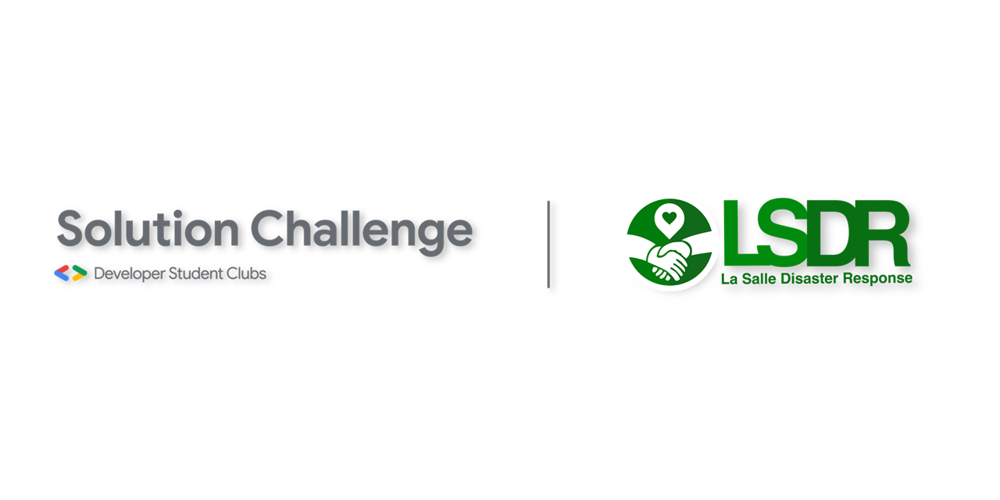

# Disaster Relief Monitoring System



This is our entry to Google Solutions Challenge 2020

Disaster Response Monitoring System is a web app that aids disaster response teams to streamline its operations. We learned that in relief operations, data updates frequently. It’s a struggle for them to exchange frequently changing data via chat messages and release that data publicly in a consistent, and transparent manner. Our solution provides them a centralized platform to communicate, and track relief operations data within the team and to the public.

## Before going to project setup
1. Make sure you have Node.js and npm installed on your local machine.
2. Clone this repository either using git clone or download the zip from GitHub.
3. Open your terminal/command prompt, go to the project directory (folder of the cloned repo)
4. Then proceed with the project setup below.

## Project setup
```
npm install
```

## To serve the application
```
npm run serve
```

## Run in the browser
enter "localhost:8080" (it's 8080 by default, but it may vary on your machine) on your browser's address bar

